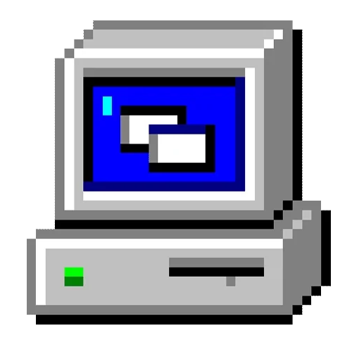

# Welcome!

My name is Matthew, and I am a cyber security and IT professional. From a young age, I have always been fascinated by computers and their endless possibilities, ranging from creating websites (like this one!) to producing music. As my passion for technology grew, I have come to discover that my true passion lies in helping maintain the safety and security of people's data. My focus is primarily on blue team cyber security activties, but i also enjoy learning more about red team activities too. I strive to protect systems from threats and ensure my digital environments are secure. This portfolio highlights my journey, skills, and projects that reflect my dedication to safeguarding valuable information in the digital world.

## My projects
Listed below are all of the cyber security and IT projects I have worked on. Each project is categorized under its respective cyber security domain.

### Cyber Security Reports and Analyses

#### Information Assurance
  - [Demonstrating RSA Encryption and Discussing Public Key Infrastructure](https://mattb-sec.github.io/RSAandPKI/)
  - [Exploring Virtualization, Nmap, and Basic Cyber Security Applications](https://mattb-sec.github.io/Virtualization-Nmap-CSecApps/)
  - [Exploring Wireshark and Analyzing Various Packets and Their Protocols](https://mattb-sec.github.io/Wireshark/)
  - [Password Cracking Methods and an Analysis of Password Cracking Programs](https://mattb-sec.github.io/PasswordCracking/)

#### Intrusion Detection and Incident Response
  - [Continuing in SimSpace, Demonstrating an ICMP Stream, and Analyzing Tools for Intrusion Detection](https://mattb-sec.github.io/IntrusionDetectionTools/)
  - [Investigating an Incident and Demonstrating the Incident Response Process](https://mattb-sec.github.io/IncidentInvestigation/)
  - [Analyzing Captured Traffic and Investigating a Potential Cyber Attack](https://mattb-sec.github.io/EventAnalysis/)
  - [A Deep Analysis of a Volatile Memory Capture File and Investigation of One or More Cyber Attacks (one of my favorites!)](https://mattb-sec.github.io/MemoryInvestigation/)

#### Network Security
  - [Applying Encryption Algorithms for Secure Communications](https://mattb-sec.github.io/SecureComms/)
  - [Configuring a Virtual Private Network Server](https://mattb-sec.github.io/VPNConfig/)
  - [Attacking a Virtual Private Network](https://mattb-sec.github.io/VPNAttack/)
  - [Penetration Testing a pfSense Firewall](https://mattb-sec.github.io/FirewallPenTest/)
  - [Using Social Engineering to Plan an Attack](https://mattb-sec.github.io/SocialEngineering/)

#### Operating Systems
  - [Installing the Linux Operating System on a Virtual Machine](https://mattb-sec.github.io/LinuxInstall/)
  - [Basic Linux Commands and Security Measures in CentOS](https://mattb-sec.github.io/LinuxCommands/)
  - [Demonstrating CentOS Logical Volume Extension and Analysis of Asymmetric Encryption on a Hard Drive](https://mattb-sec.github.io/FileSysMgmt/)
  - [Analyzing Process Relationships and Scheduling](https://mattb-sec.github.io/ProcessAnalysis/)
  - File System Management and Asymmetric Encryption in CentOS
  - User Accounts Management, Permissions, and Privileges in CentOS and Analyzing the Dirty Cow Exploit

#### Secure Web Application Development
  - Cross-Site Request Forgery
  - Cross-Site Scripting (XSS) Attack
  - SQL Code Injection
  - Web Tracking

### Malicious Link Analysis
  - Poisoned Job Application Link
  - Steam Gift Scam

### Security Audit
  - Botium Scope and Goals and Risk Assessment Report
  - Controls and Compliance Checklist
